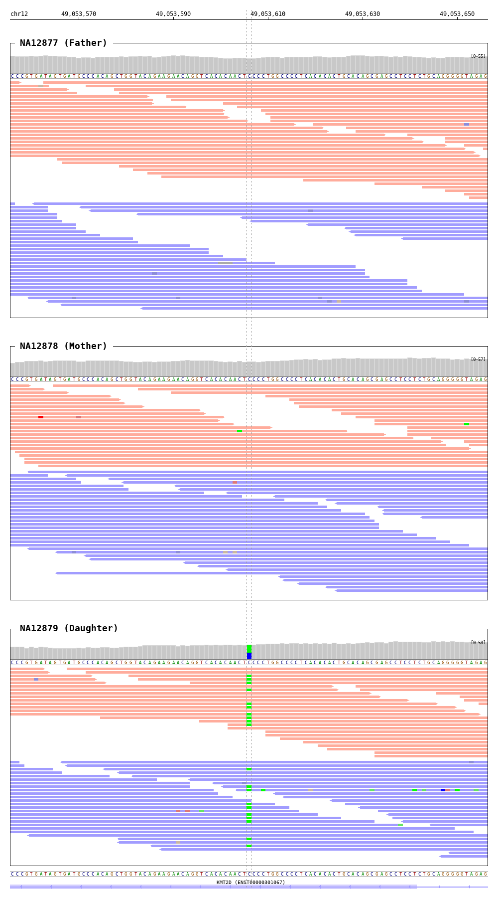

=======
Bamsnap
=======

This step uses ``bamsnap`` (https://academic.oup.com/bioinformatics/article-abstract/37/2/263/6069566) to generate a zip archive of bamsnap images for all the variants in the given ``vcf`` file and its associated ``bam`` files.

* CWL: bamsnap.cwl

Output
++++++

An example output ``png`` file looks as below:

