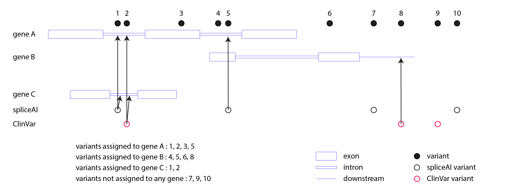
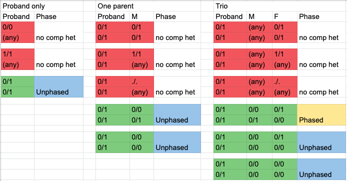

=======================================
Calling compound heterozygous mutations
=======================================

This step uses ``granite comHet`` to call compound heterozygous mutations by genes and transcripts, assigning the associate risk based on available annotations. The output vcf file is checked for integrity to ensure the format is correct and the file is not truncated.

* CWL: workflow_granite-comHet_plus_vcf-integrity-check.cwl

Requirements
++++++++++++

The input VCF must have VEP annotations (VEP consequences, gene and transcript are required).

Specifications
++++++++++++++

Gene Assignments
----------------

To determine compound heterozygous pairs, variants must be first assigned to genes. For consistent and inclusive gene assignment, we followed the rules described below:

  1. Since we do not include intronic variants in our filtered set, we also do not assign variants to a gene/transcript if the variant is in an intron of the gene/transcript and can be assigned to a different gene/transcript (i.e. the variant is in an exon of a different gene/transcript).
  2. If a variant is in an intron of a gene/transcript and is not an exon of any other gene/transcript but is either predicted by spliceAI to be potential splice variant or is a ClinVar variant, then we do assign the variant to this gene, even though it is in an intron.
  3. Since we do not include variants in an upstream/downstream region of a gene/transcript, we also do not assign variants to a gene/transcript if the variant is in an upstream/downstream region of the gene/transcript, except if the variant is a ClinVar variant.

This gene assignment is ensured by first 'cleaning' the pre-existing VEP annotation according to spliceAI and ClinVar annotations. This VEP cleaning is performed during the Filtering step of the pipeline. The Compound Het calling step assumes that VEP annotation in the input VCF already reflects the above rules.

Output
++++++

The output VCF preserves the input VCF and adds information to variants that are potentially compound heterozygous (no lines are removed). This additional information is in the following format:

::

    comHet=<Phased_or_Unphased>|<gene_id>|<transcript_id>|<impact_of_comphet_pair>|<mate_variant>

It looks as below for example:

::

    comHet=Phased|ENSG00000084636|ENST00000373672|ms/L|chr1:31662352G>A

Phase
-----

A compound het pair is either phased or unphased.

Impact
------

The impact of a compound heterozygous pair is determined as below:

