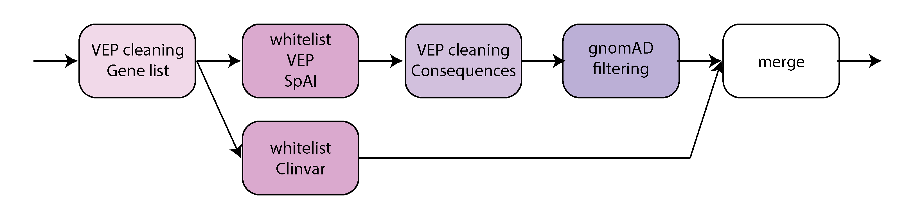

==================
Filtering variants
==================

This step performs filtering of the variants.

* CWL: workflow_granite-filtering_plus_vcf-integrity-check.cwl

Requirements
++++++++++++

A single, annotated ``vcf`` file is an input. The annotation should include annotation of VEP, ClinVar and SpliceAI.

This step can optionally take in a panel of unrelated samples in the ``.big`` format for blacklisting variants with reads appearing in unrelated samples, but this option is not used for the current pipeline.

Steps
+++++

The filtering step is composed of multiple steps and the output ``vcf`` file is checked for integrity to ensure the format is correct and the file is not truncated.

Genelist
---------

The genelist step uses ``granite geneList`` to clean VEP annotations for transcripts that are not mapping to any gene of interest (i.e., genes not present on the CGAP Portal). It is similar to VEP cleaning (below) but applies to genes rather than consequences. This step does not remove any variants, but only modifies the VEP annotation.

Whitelist
---------

The whitelist steps use ``granite whiteList`` to filter-in exonic and functionally relevant variant based on VEP, ClinVar and SpliceAI annotations. The ClinVar whitelist is performed separately so that the result does not undergo VEP cleaning and filtering by blacklist.

VEP cleaning
------------

This step uses ``granite cleanVCF`` to clean VEP annotations, to remove consequences that we do not want to include, such as introns. This step removes variants that remain with no VEP annotations after the cleaning.

Blacklist
---------

The blacklist step uses ``granite blackList`` to filter-out common and shared variant based on gnomAD population allele frequency and a panel of unrelated samples. The panel of unrelated samples is in the .big format that contains the binary data (1: to be filtered, 0: not to be filetered) for every genomic position.

Merging
-------

The ClinVar whitelist result is merged with the rest of the filtering result. For variants that overlap between the two, the ClinVar entry is chosen to preserve the entry without VEP cleaning for ClinVar variants.

Output
++++++

The output is a filtered ``vcf`` file containing a lot fewer entries compared to the input ``vcf``. The content of the remaining entries are identical to the input (no additional information added) except the VEP annotation has been cleaned up to remove irrelevant consequences.
