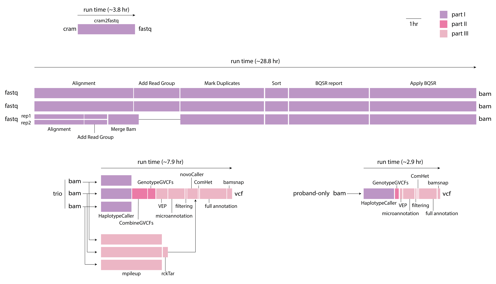

=================
CGAP WGS Pipeline
=================

CGAP WGS pipeline allows to process Whole Genome Sequencing (WGS) data starting from fastq files and produce ``bam``, ``g.vcf`` and ``vcf`` files as output. Optionally, the pipeline can take a ``cram`` file and convert it to ``fastq`` files to go through the rest of the pipeline.

The pipeline is designed for a trio analysis with proband diagnosed with a likely monogenic disease. It is optimized for data with 30x coverage and has been tested with data up to 80-90x coverage.

The pipeline is mostly based on ``bwa``, ``gatk4``, ``granite`` (https://github.com/dbmi-bgm/granite), ``mutanno`` (https://github.com/dbmi-bgm/mutanno) and ``bamsnap`` (https://github.com/parklab/bamsnap). The pipeline perform joint-sample variant calling within a family, performs annotation and filtering, calls de novo mutations and compound hets, and generates snapshot images for the filtered set of variants.

Docker Image
############

* The current docker image is ``cgap/cgap:v19``

The image contains (but is not limited to) the following software packages:

- bwa (0.7.17)
- gatk4 (4.1.2.0)
- picard (2.20.2)
- granite (0.1.6)
- bamsnap (0.2.14)
- samtools (1.9)
- bcftools (1.11)
- cramtools (0b5c9ec)
- pigz (2.4)
- pbgzip (2b09f97)
- vep (101)
- parallel

Pipeline Flow
#############

The overall flow of the pipeline looks as below:

.. image:: images/bioinfo-snv-indel-flow-v20-20210115.png

Pipeline Parts and Runtimes
###########################

Largely, the pipeline consists of three parts:

  | Part 1. GATK-based per-sample processing
  | Part 2. GATK-based per-family variant calling
  | Part 3. annotation and inheritance mode analysis

The part associations and the run time of the different steps are summarized in the following diagram:

Pipeline Steps
##############

.. toctree::
   :maxdepth: 4

   wgs-part1
   wgs-part2
   wgs-part3
