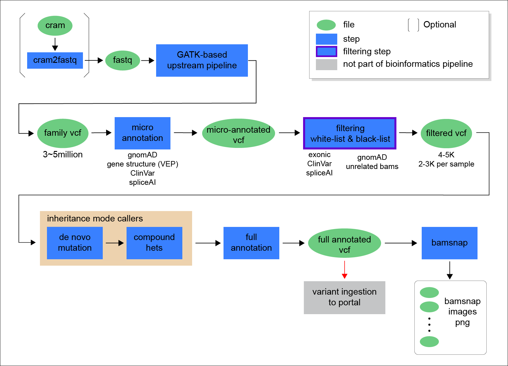
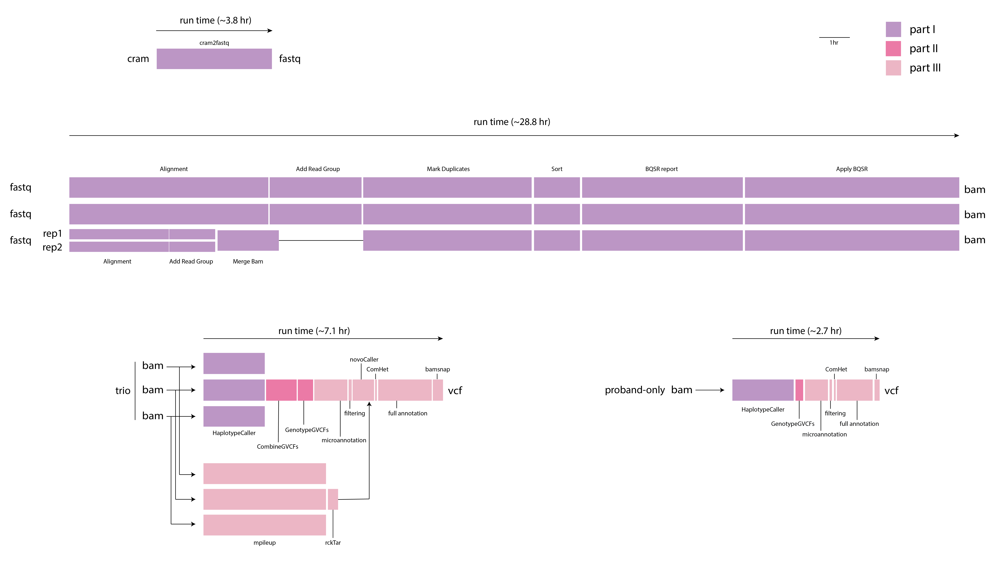

=================
CGAP WGS Pipeline
=================

CGAP WGS pipeline allows to process Whole Genome Sequencing data starting from fastq files and produce ``bam``, ``g.vcf`` and ``vcf`` files as output.

The pipeline is designed for trio analysis with proband diagnosed with a likely monogenic disease. It is optimized for data with 30x coverage and has been tested with data up to 80-90x coverage.

The pipeline is mostly based on ``bwa``, ``gatk4``, ``granite`` (https://github.com/dbmi-bgm/granite), ``mutanno`` (https://github.com/dbmi-bgm/mutanno) and ``bamsnap`` (https://github.com/parklab/bamsnap). The pipeline perform joint-sample variant calling within a family, performs annotation and filtering, calls de novo mutations and compound hets, and generates snapshot images for the filtered set of variants.

Docker Image
############

* Current docker image is ``cgap/cgap:v14``

The image contains (but is not limited to) the following software packages:

- gatk4 4.1.2.0
- picard 2.20.2
- bwa 0.7.17
- samtools 1.9
- parallel
- granite (914b7ef)
- mutanno (0.4.2)
- bamsnap (0.2.5)
- cramtools (0b5c9ec)
- pigz (2.4)
- pbgzip (2b09f97)

Pipeline Flow
#############

The overall flow of the pipeline looks as below:

Largely, the pipeline consists of three parts:

  | Part 1. GATK-based per-sample processing
  | Part 2. GATK-based per-family variant calling
  | Part 3. annotation and inheritance mode analysis

The part associations and the run time of the different steps are summarized in the following diagram:

Pipeline Steps
##############

.. toctree::
   :maxdepth: 4

   wgs-step-alignment
   wgs-step-addrg
   wgs-step-mergebam
   wgs-step-markdup
   wgs-step-sort
   wgs-step-bqsr
   wgs-step-applybqsr
   wgs-step-hc
   wgs-step-combinegvcf
   wgs-step-genotypegvcf
   wgs-step-microannot
   wgs-step-filtering
   wgs-step-denovo
   wgs-step-comhet
   wgs-step-fullannot
   wgs-step-bamsnap
