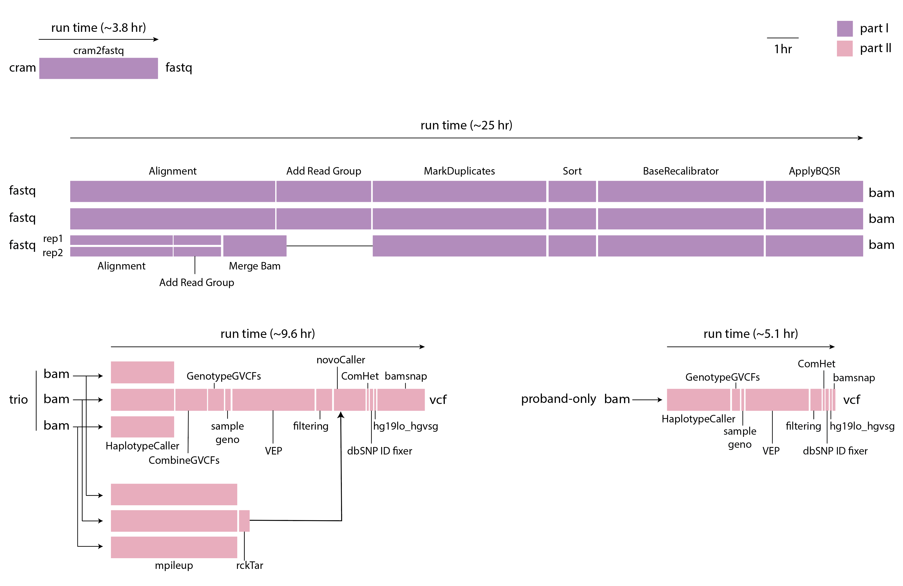

==========================
CGAP WGS and WES pipelines
==========================

CGAP WGS pipeline processes Whole Genome Sequencing (WGS) data starting from ``fastq`` files and produces ``bam``, ``g.vcf`` and ``vcf`` files as output. Optionally, the pipeline can take a ``cram`` file and convert it to ``fastq`` files to go through the rest of the pipeline.

The WGS pipeline is designed for a trio analysis with proband diagnosed with a likely monogenic disease. It is optimized for data with 30x coverage and has been tested with data up to 80-90x coverage. It can also be run in proband-only, and family modes using appropriate metaworkflows.

CGAP WES pipeline is a recent extension of the WGS pipeline, which allows for the processing of Whole Exome Sequencing (WES) data starting from ``fastq`` files from a proband, trio or family to produce ``bam``, ``g.vcf`` and ``vcf`` files as output. We are currently optimizing for 90x coverage and testing from 20x-200x.

Both pipelines are mostly based on ``bwa``, ``gatk4``, ``granite`` (https://github.com/dbmi-bgm/granite), ``ensembl-vep`` (https://github.com/Ensembl/ensembl-vep) and ``bamsnap`` (https://github.com/parklab/bamsnap). The pipelines perform joint-sample variant calling within a family, perform annotation and filtering, call *de novo* mutations and compound hets, and generate snapshot images for the filtered set of variants.

Docker Image
############

The public docker image for most of the WGS/WES pipeline and QC steps is ``cgap/cgap:v25``

The image contains (but is not limited to) the following software packages:

- bwa (0.7.17)
- gatk4 (4.1.2.0)
- picard (2.20.2)
- granite (0.1.12)
- bamsnap (0.2.19)
- samtools (1.9)
- bcftools (1.11)
- cramtools (0b5c9ec)
- pigz (2.4)
- pbgzip (2b09f97)
- vep (101)
- peddy (0.4.7)

The public docker image for ``md5`` is ``cgap/md5:v25``
The ``Dockerfile`` for this image can be found here: https://github.com/4dn-dcic/docker-md5/blob/master/Dockerfile

This image contains (but is not limited to) the following software packages:

- md5sum (8.25)

The public docker image for ``fastqc`` is ``cgap/fastqc:v25``
The ``Dockerfile`` for this image can be found here: https://github.com/4dn-dcic/docker-fastqc/blob/master/Dockerfile

This image contains (but is not limited to) the following software packages:

- fastqc (0.11.9)

CGAP is now running on a deployable model. Public docker images are pushed to private ECRs using the ``post_patch_to_portal.py`` script during deployment and/or pipeline updates.

Pipeline Flow
#############

The overall flow of the pipeline looks as below:

.. image:: images/bioinfo-snv-indel-flow-v22-20210526.png

Pipeline Parts and Runtimes
###########################

Largely, the pipeline consists of two parts:

  | Part 1. GATK Best Practice Mapping and Variant Calling
  | Part 2. Variant Annotation and Filtering

The run time of the different steps are summarized in the following diagram:

Pipeline Steps
##############

.. toctree::
   :maxdepth: 2

   wgs-part1
   wgs-part2
   validation
