## bwa mem ##
Job ID: 4KxysTYKBTxw

Instance ID: 085fbae4be0d8c54a

Input files:
  - maestro-resources/PSC-01-003_R2.fastq.gz (34.2 GiB)
  - maestro-resources/PSC-01-003_R2.fastq.gz (40.7 GiB)

Output files:
  - soos-4dn-bucket/pipeline_cwl_TEST/PSC-01-003_raw.bam (103.4 GiB)
  - soos-4dn-bucket/pipeline_cwl_TEST/PSC-01-003_raw.bam_integrity_check

Instance type: c5n.18xlarge

Ebs size: 506 GiB (6.3x)

Parameters:
  - threads [72]
  - outdir [.]
  - prefix [raw]
  - count [0]

CPU and Memory usage:
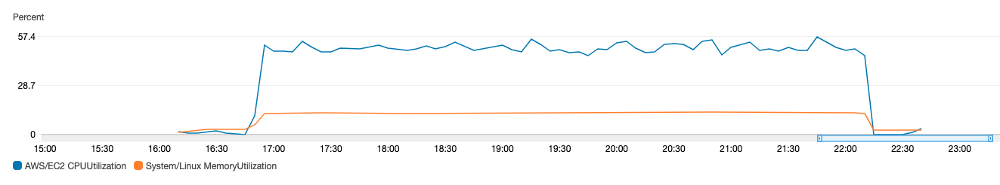

Maximum Disk Usage: 422 GiB
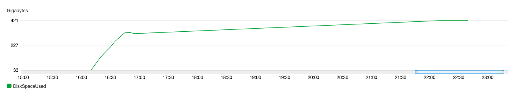

Time: 12:09:28 - 18:45:21

Price:

## AddReadgroups ##
Job ID: FqnXb0tLyUM7

Instance ID: 0ba509c0d3221799f

Input files:
  - soos-4dn-bucket/pipeline_cwl_TEST/PSC-01-003_raw.bam (103.4 GiB)

Output files:
  - soos-4dn-bucket/pipeline_cwl_TEST/PSC-01-003_raw_rg.bam (103.5 GiB)
  - soos-4dn-bucket/pipeline_cwl_TEST/PSC-01-003_raw_rg.bam_integrity_check

Instance type: t3.large

Ebs size: 311 GiB (3x)

Parameters:
  - count [0]

CPU and Memory usage:
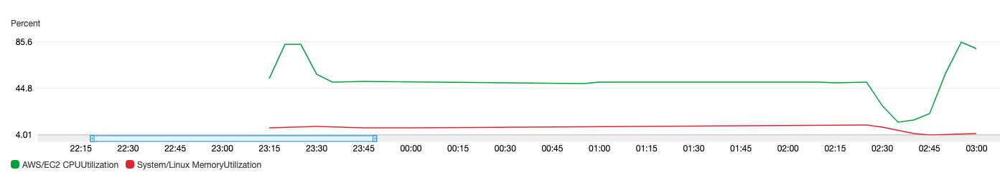

Maximum Disk Usage: 207 GiB
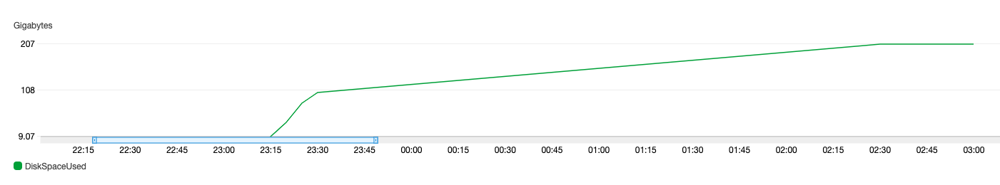

Time: 19:16:18 - 23:01:52

Price:

## MarkDuplicates ##
Job ID: 989zvqgQTGYM

Instance ID: 00503402aee6478fc

Input files:
  - soos-4dn-bucket/pipeline_cwl_TEST/PSC-01-003_raw_rg.bam (103.5 GiB)

Output files:
  - soos-4dn-bucket/pipeline_cwl_TEST/PSC-01-003_raw_rg_rm.bam (104.3 GiB)
  - soos-4dn-bucket/pipeline_cwl_TEST/PSC-01-003_raw_rg_rm.bam_integrity_check
  - soos-4dn-bucket/pipeline_cwl_TEST/PSC-01-003_raw_rg_rm.bam_duplicate_metrics (4.1 KiB)

Instance type: c5n.18xlarge

Ebs size: 415 GiB (4x), should be 260 GiB (2.5x)

Parameters:
  - xmx [-Xmx160G]
  - xms [-Xms160G]
  - max_records_in_ram [2000000]
  - duplicate_pixel_distance [2500]
  - count [0]

CPU and Memory usage:
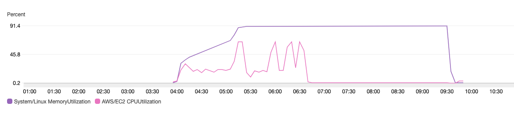

Maximum Disk Usage: 208 GiB
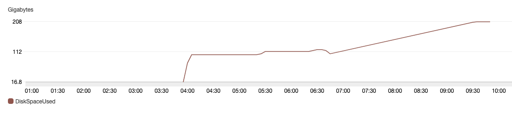

Time: 23:56:46 - 05:52:32

Price:

## sort ##
Job ID: 5aA4SOpqpJyo

Instance ID: 0fdc4992b10e1220d

Input files:
  - soos-4dn-bucket/pipeline_cwl_TEST/PSC-01-003_raw_rg_rm.bam (104.3 GiB)

Output files:
  - soos-4dn-bucket/pipeline_cwl_TEST/PSC-01-003_sorted_rg_rm.bam (67.3 GiB)
  - soos-4dn-bucket/pipeline_cwl_TEST/PSC-01-003_sorted_rg_rm.bam_integrity_check

Instance type: m5a.2xlarge

Ebs size: 313 GiB (3x)

Parameters:
  - max_memory [3G]
  - num_threads [8]
  - count [0]

CPU and Memory usage:
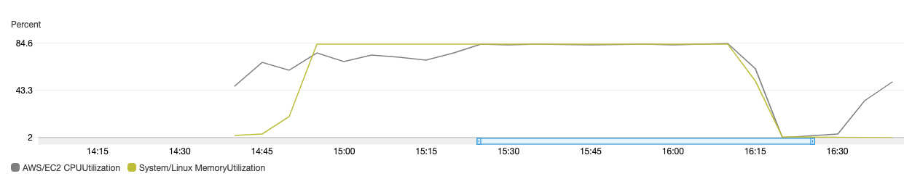

Maximum Disk Usage: 273 GiB
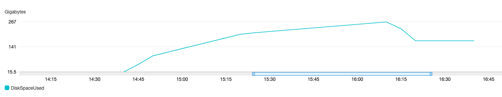

Time: 10:40:06 - 12:45:29

Price:

## BaseRecalibrator ##
Job ID: vtequ2GITUuK

Instance ID: 0d06f614eecef2f70

Input files:
  - soos-4dn-bucket/pipeline_cwl_TEST/PSC-01-003_sorted_rg_rm.bam (67.3 GiB)

Output files:
  - soos-4dn-bucket/pipeline_cwl_TEST/PSC-01-003_sorted_rg_rm.bam_recalibration_report (247.8 KiB)

Instance type: t3.small

Ebs size: 144 GiB (2x)

CPU and Memory usage:
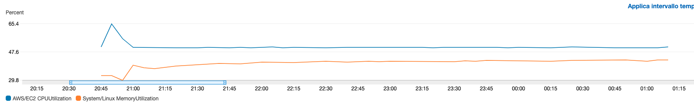

Maximum Disk Usage: 72 GiB
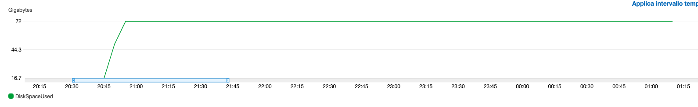

Time: 04:44:09 - 09:14:47

Price:

## ApplyBQSR ##
Job ID: XtHCdBTSnWMH

Instance ID: 0e29b90e20aa1b5ec

Input files:
  - soos-4dn-bucket/pipeline_cwl_TEST/PSC-01-003_sorted_rg_rm.bam (67.3 GiB)
  - soos-4dn-bucket/pipeline_cwl_TEST/PSC-01-003_sorted_rg_rm.bam_recalibration_report (247.8 KiB)

Output files:
  - soos-4dn-bucket/pipeline_cwl_TEST/PSC-01-003_sorted_rg_rm_recalibrated_full.bam
  - soos-4dn-bucket/pipeline_cwl_TEST/PSC-01-003_sorted_rg_rm_recalibrated_full.bam_integrity_check

Instance type: t3.micro

Ebs size: 176 GiB (2.5x)

Parameters:
  - static-quantized-quals_1 [10]
  - static-quantized-quals_2 [20]
  - static-quantized-quals_3 [30]
  - count [0]

CPU and Memory usage:
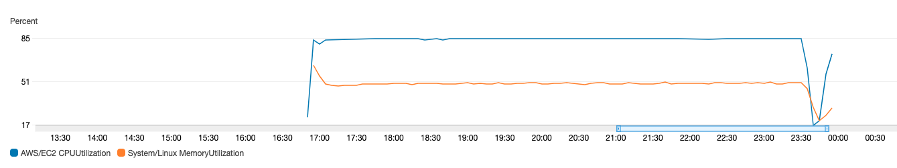

Maximum Disk Usage: 142 GiB
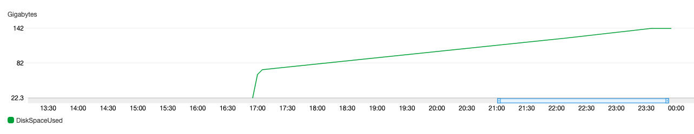

Time: 12:53:36 - 19:59:28

Price:
